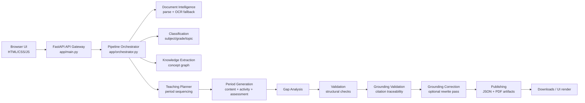

# Teacher Knowledge Package Pipeline

Generate a classroom-ready **Teacher Knowledge Package (TKP)** from a raw
educational document. The pipeline turns PDFs, DOCX, PPTX, and plain text into
structured teaching material with:

- a sequenced teaching plan,
- per-period teacher scripts,
- classroom activities,
- assessments,
- learning-gap analysis,
- grounding checks,
- and downloadable JSON/PDF artifacts.

This project is intentionally built with **plain HTML, CSS, and JavaScript** on
the frontend and **FastAPI + Python** on the backend. No heavy agent framework
is used; the pipeline is a set of explicit stages wired together in code so it
stays debuggable and easy to modify.

For the deeper implementation walkthrough, see
[`docs/IMPLEMENTATION_GUIDE.md`](docs/IMPLEMENTATION_GUIDE.md).

## What it includes

- Document upload with live progress updates over SSE
- Optional curriculum-board and teaching-style hints
- PDF/DOCX/PPTX/TXT parsing with OCR fallback for scanned PDFs
- LLM-based classification, knowledge extraction, planning, and generation
- Combined per-period generation for content, activity, and assessment
- Structural validation and grounding traceability checks
- Closed-loop grounding correction for flagged claims
- JSON + PDF publishing with downloadable artifacts
- Batch evaluation harness for user-provided benchmark documents

## Quick start

You need Python 3.11+ and a Groq API key.

```bash
git clone <this-repo>
cd teacher-knowledge-package-pipeline
python -m venv venv
.\venv\Scripts\Activate.ps1
pip install -r requirements.txt

export GROQ_API_KEY=gsk_...
# Optional: choose a smaller/faster model
# export GROQ_MODEL=llama-3.1-8b-instant

uvicorn app.main:app --reload --port 8000
```

Then open `frontend/index.html` directly in a browser or serve it as static
files:

```bash
python -m http.server 8080 --directory frontend
```

Visit `http://localhost:8080`, upload a document, and watch the pipeline move
through the stages in real time.

## Repository layout

```text
teacher-knowledge-package-pipeline/
├─ app/
│  ├─ main.py                 # FastAPI API gateway
│  ├─ orchestrator.py         # Stage sequencing and SSE progress
│  ├─ llm_client.py           # Structured Groq calls + retries
│  ├─ models/schemas.py       # Shared TKP data contract
│  └─ services/               # Document, planning, validation, publishing
├─ frontend/
│  ├─ index.html              # Vanilla UI
│  └─ styles.css              # UI styling
├─ samples/                   # Small sample inputs for testing
├─ scripts/evaluate_pipeline.py
└─ docs/IMPLEMENTATION_GUIDE.md
```

## High-level architecture



## Main workflow

1. The user uploads a document and optional hints such as grade, curriculum
   board, or teaching style.
2. The backend parses the file and extracts raw text and document structure.
3. The model classifies the document, extracts knowledge, and creates a plan.
4. Each period is generated as a combined bundle: content, activity, and
   assessment.
5. Validation checks internal consistency.
6. Grounding checks compare generated citations against the source text.
7. If grounding fails, the affected content is regenerated once with reviewer
   notes.
8. The final package is published as JSON and PDFs, then streamed back to the
   browser.

## API surface

### `GET /`
Serves the frontend shell.

### `GET /api/health`
Simple health check returning `{ "status": "ok" }`.

### `POST /api/generate`
Accepts:

- `file` upload
- optional `grade_override`
- optional `teaching_objectives`
- optional `teaching_style`
- optional `time_constraint_minutes`
- optional `curriculum_board`
- optional `document_type_hint`

Returns an **SSE stream** with stage progress updates and the final package.

### `GET /api/download/{job_id}/{artifact}`
Returns one of the published artifacts:

- `json`
- `lesson_plan_pdf`
- `teacher_guide_pdf`
- `assessment_book_pdf`

## Configuration

**LLM provider**: set ANY ONE of `GROQ_API_KEY`, `GEMINI_API_KEY`,
`ANTHROPIC_API_KEY`, or `OPENAI_API_KEY` and the pipeline auto-detects which
provider to use (`app/llm_providers/__init__.py`) -- no code changes needed
regardless of which one you have. If more than one is set, `LLM_PROVIDER`
(`groq` | `gemini` | `anthropic` | `openai`) picks explicitly; otherwise the
auto-detect priority is groq, then gemini, then anthropic, then openai. This
project is currently configured to run on Anthropic (Claude) by default --
see `.env.example`.

Other common environment variables:

- `GROQ_MODEL` / `GEMINI_MODEL` / `ANTHROPIC_MODEL` / `OPENAI_MODEL` — optional
  model override for whichever provider is active
- `PERIOD_GENERATION_CONCURRENCY` — optional parallelism for period jobs
  (default 1; see the note in `.env.example` about token-per-minute limits)

## Design choices worth knowing

- **No LangChain/LlamaIndex**: the pipeline is hand-wired for predictability.
- **One shared schema**: all stages read/write `TeacherKnowledgePackage`.
- **Combined period generation**: reduces token use and latency versus three
  separate calls per period.
- **SSE instead of polling**: the browser gets live progress updates without a
  websocket server.
- **Retrieval over the source document**: each period retrieves the source
  chunks most relevant to its own concepts (`app/services/retrieval.py`,
  TF-IDF + cosine similarity) rather than every stage receiving the same
  blind truncated excerpt of the whole document. See "Why not a single LLM
  call?" below for the same reasoning applied to the pipeline as a whole.
- **Grounding by citations**: generation can be creative, but factual claims
  should trace back to a retrieved source passage above a similarity
  threshold, not just share vocabulary with the document in general.

## Why not a single LLM call?

A single prompt asking for the whole Teacher Knowledge Package in one shot
would be simpler to write, and it's worth being explicit about why that's
not what this does:

- **Modular**: each stage is independently testable and replaceable. Swapping
  how knowledge extraction works doesn't touch assessment generation.
- **Retryable at the right granularity**: if period 3's generation fails
  schema validation, only period 3 retries -- a single mega-call failing
  means regenerating everything, including the parts that were already fine.
- **Lower token cost per call**: smaller, focused prompts mean smaller
  context windows and smaller expected outputs, which matters concretely on
  a rate-limited free tier where total tokens/minute is a hard ceiling.
- **Easier validation**: Stage 9 and Stage 9b can check structural
  consistency and grounding against a fully-formed intermediate object.
  There's no clean way to validate "is this consistent" against a single
  giant blob the model is still in the middle of generating.
- **Easier debugging**: when something's wrong with the output, the pipeline
  tells you which stage produced it. A single-call failure just tells you
  the whole thing is wrong somewhere.

The tradeoff is real, too: more total round-trips than one call, and each
stage only sees what previous stages chose to pass it rather than the full
document context at every step. The retrieval layer exists specifically to
soften that second cost -- see above.

## Running the evaluation harness

Use the sample or your own documents:

```bash
python scripts/evaluate_pipeline.py --files samples/test_input.txt --model llama-3.1-8b-instant
```

Or point it at a folder of owned benchmark documents:

```bash
python scripts/evaluate_pipeline.py --input-dir benchmarks --model llama-3.1-8b-instant
```

## Important limitations

- The repo does **not** bundle copyrighted NCERT chapters.
- Grounding checks rely on TF-IDF similarity between a citation and retrieved
  source chunks, not human review -- the similarity threshold
  (`MIN_SIMILARITY` in `app/services/grounding_validation.py`) is a tuned
  judgment call, not a proof of correctness. It's deliberately TF-IDF rather
  than neural embeddings, mainly to avoid a runtime model download on a
  free-tier deployment; see `retrieval.py`'s docstring for the full reasoning
  and when that tradeoff would stop being the right one.
- Job artifacts are stored on disk plus a small in-memory map, which is fine for
  a single-process demo but not for multi-worker production.
- Retrieval is per-document (each upload builds its own index), not a
  persistent corpus-wide index across multiple uploaded documents.

## Related documentation

- [`docs/IMPLEMENTATION_GUIDE.md`](docs/IMPLEMENTATION_GUIDE.md) — detailed
  architecture and implementation guide
- [`samples/README.md`](samples/README.md) — sample inputs included with the repo
