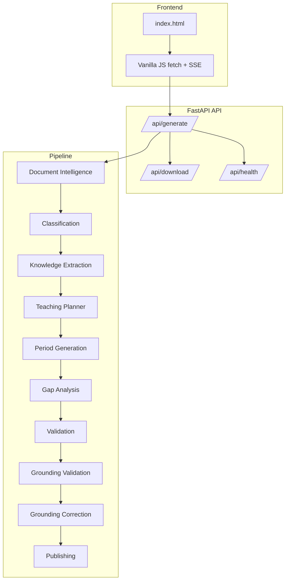
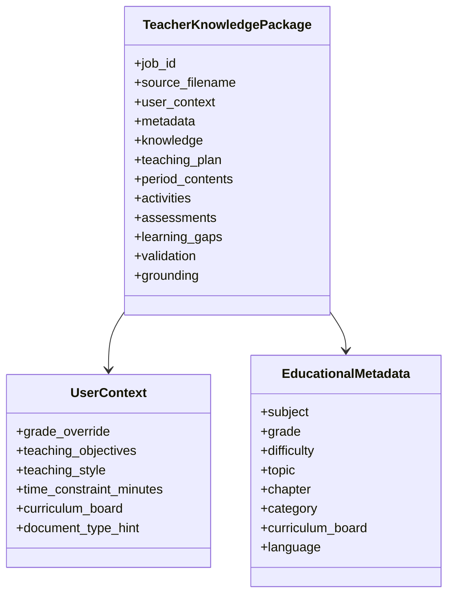
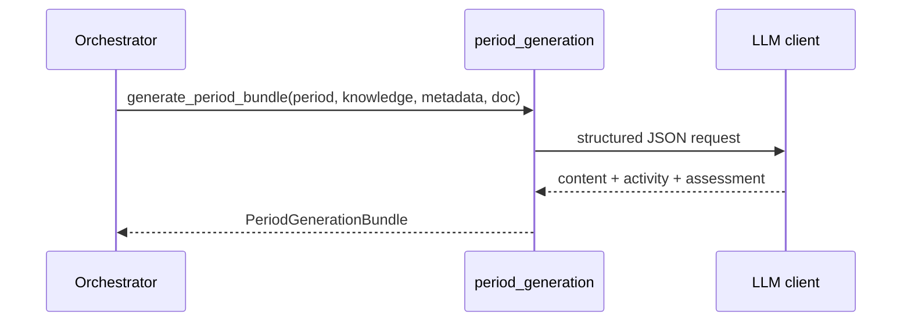
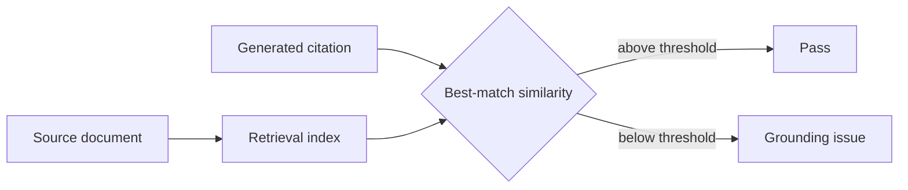
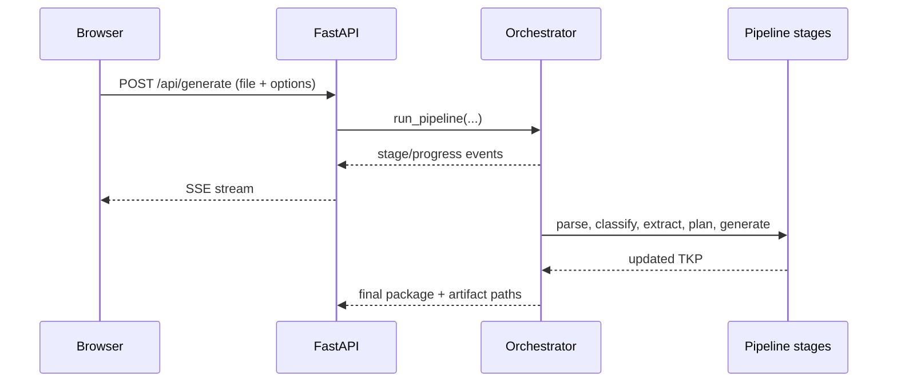

# Implementation Guide

This document explains how the Teacher Knowledge Package pipeline is wired
together, what each subsystem does, and what the project deliberately does not
try to solve.

## System overview

The application has three layers:

1. **Frontend** — plain HTML/CSS/JavaScript for upload, options, progress, and
   downloads.
2. **API layer** — FastAPI routes for generation, health checks, and artifact
   downloads.
3. **Pipeline layer** — the orchestrated document-processing and LLM stages.

## Data contract

All stages pass around the same Pydantic model:

- `TeacherKnowledgePackage`

It contains:

- source metadata
- extracted knowledge
- a teaching plan
- per-period content
- activities and assessments
- learning gaps
- validation reports
- grounding reports

This shared contract is what makes the pipeline easy to reason about: every
stage consumes one version of the package and returns the next version.

## Stage-by-stage implementation

### 1. Document intelligence

`app/services/document_intelligence.py` parses the uploaded file into:

- raw text
- page/block structure
- metadata such as page count and format

It chooses between direct text extraction and OCR based on the document-type
hint and simple heuristics. Scanned PDFs go through OCR; text-heavy documents
stay on the fast path.

### 2. Classification

`app/services/classification.py` infers:

- subject
- grade
- difficulty
- topic
- chapter
- category
- language

The optional curriculum board is threaded into this stage so the model can
align output to the right curriculum framing.

### 3. Knowledge extraction

`app/services/knowledge_extraction.py` turns the parsed document into a
compact knowledge graph:

- learning objectives
- prerequisites
- concepts
- keywords
- examples
- applications
- misconceptions

This stage is where the long document is condensed into a more reusable form.

### 4. Teaching planner

`app/services/teaching_planner.py` decides:

- how many periods to create
- how long each period should be
- which concepts belong together

The planner is what turns a document into a teaching sequence.

### 5. Period generation

`app/services/period_generation.py` generates a full period bundle in one pass:

- `PeriodContent`
- `Activity`
- `Assessment`

This is a key optimization. Instead of making three separate LLM calls per
period, the pipeline now produces a coherent bundle together, which improves
latency and helps keep the content aligned.

### 6. Gap analysis

`app/services/gap_analysis.py` identifies likely misconceptions and suggests
remedial actions.

### 7. Structural validation

`app/services/validation.py` checks internal consistency, such as:

- every teaching-plan period has generated content and assessment
- MCQs have the expected number of options
- required fields are present

This stage does **not** compare against the source document. It only checks the
package for internal coherence.

### 8. Grounding validation

`app/services/grounding_validation.py` checks whether generated claims are
traceable to the source document, using `app/services/retrieval.py`'s
TF-IDF index rather than a strict literal substring match. A citation is
compared against its single best-matching retrieved chunk by cosine
similarity; below `MIN_SIMILARITY` it's flagged. This replaced an earlier
version requiring an exact 4-word run overlap with the source text, which
in testing flagged plenty of correct paraphrases as ungrounded -- a citation
saying "objects at rest remain at rest unless a force acts" shares no
4-word run with a source phrased "An object at rest stays at rest... unless
acted upon by a net external force", despite being clearly grounded in it.

Current design choice:

- generated content can be pedagogically richer than the source
- factual claims should still be backed by a retrieved source passage
- unsupported citations are flagged as grounding issues

### 9. Grounding correction

If grounding fails, `app/services/grounding_correction.py` performs a rewrite
pass for the affected period(s).

This is a lightweight closed loop:

1. detect unsupported claims
2. pass reviewer notes back into regeneration
3. re-run grounding validation

### 10. Publishing

`app/services/publishing.py` writes:

- `TeacherKnowledgePackage.json`
- `LessonPlan.pdf`
- `TeacherGuide.pdf`
- `AssessmentBook.pdf`

The API stores the paths so the download route can serve them later.

## LLM client behavior

`app/llm_client.py` is the shared structured-generation helper.

It handles:

- JSON-schema-based structured output
- retries for malformed generations
- comment stripping from bad JSON
- payload-shape normalization
- rate-limit backoff
- safer defaults for token usage

This keeps the stage code small; most stage modules only focus on prompts and
data transformations.

## Runtime flow

## What this project does not do

These are intentional non-goals, not accidental omissions:

- It does **not** bundle copyrighted NCERT chapters.
- It does **not** use a full agent framework like LangChain.
- It does **not** require a database for the demo flow.
- It does **not** use a frontend framework.
- It does **not** index across multiple documents into one corpus -- each
  upload builds its own retrieval index, scoped to that document only.
- It does **not** claim grounding is perfect; similarity-based matching has
  a tuned threshold, not a proof.

## Practical limitations

### 1. In-memory job tracking

`JOB_ARTIFACTS` is intentionally simple and works well for a single-process
demo, but it is not enough for multi-worker deployment.

### 2. Retrieval quality

`retrieval.py` uses TF-IDF + cosine similarity rather than neural
embeddings, a deliberate tradeoff for a single-document retrieval scope
documented in that file's docstring -- it avoids a runtime model download,
at some cost to synonym/paraphrase recall relative to a dense embedding
model. For a genuinely synonym-heavy domain or corpus-scale retrieval
across many documents, that tradeoff would need revisiting.

### 3. Rate limits

Free-tier Groq usage can still rate-limit heavy runs. The client retries, but
latency and throughput still depend on model selection and concurrency.

## How to extend it

- Add a database for durable job tracking
- Swap TF-IDF retrieval for neural embeddings if corpus scale grows
- Add more curriculum-board-specific prompt variants
- Add richer citation linking in the UI
- Add CSV/HTML exports for evaluation runs

## Suggested reading order

If you are new to the repo, read these in order:

1. `README.md`
2. `app/models/schemas.py`
3. `app/orchestrator.py`
4. `app/llm_client.py`
5. `app/services/grounding_validation.py`
6. `app/services/publishing.py`
